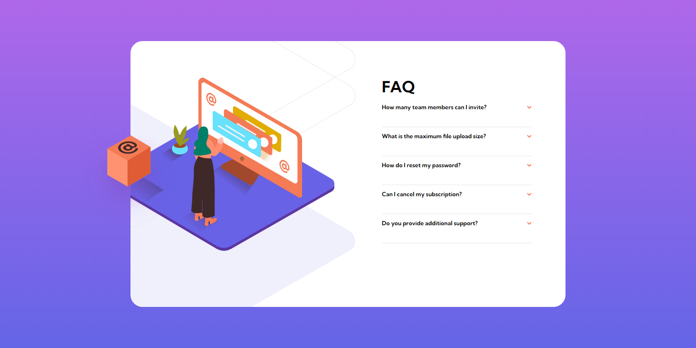
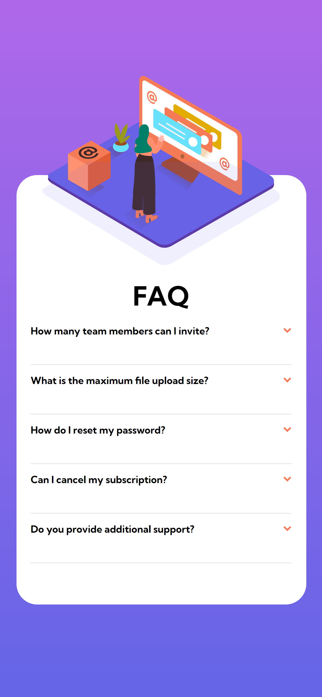

# Frontend Mentor - FAQ accordion card solution

This is a solution to the [FAQ accordion card challenge on Frontend Mentor](https://www.frontendmentor.io/challenges/faq-accordion-card-XlyjD0Oam). 

## Overview

### The challenge

Users should be able to:

- View the optimal layout for the component depending on their device's screen size
- See hover states for all interactive elements on the page
- Hide/Show the answer to a question when the question is clicked

### Screenshot

### Links

- Solution URL: [Frontendmentor](https://www.frontendmentor.io/challenges/faq-accordion-card-XlyjD0Oam/hub)
- Live Site URL: [Github Pages](https://github.com/juanmderosa/react-faq-accordion-card)

## My process

### Built with

- Semantic HTML5 markup
- CSS custom properties
- Flexbox
- Responsive Design
- [React](https://reactjs.org/) - JS library
## Author

- Website - [Juan Martín De Rosa](https://juanmderosa-developer.com/)
- Frontend Mentor - [@juanmderosa](https://www.frontendmentor.io/profile/juanmderosa)
- Linkedin - [Juan Martín De Rosa](https://www.linkedin.com/in/juanmderosa/)

